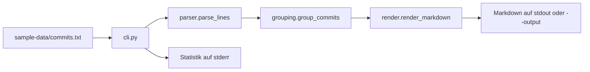

# RelNotes – Release Notes aus Conventional Commits

Kursprojekt zum ppedv-Seminar **Agentic Coding – KI-Agenten im Entwickleralltag**.

RelNotes ist ein kleines CLI-Tool, das aus Git-Historie (Conventional Commits)
strukturierte Release Notes generiert – und im Kurs den kompletten Team-Workflow
durchläuft: **Issue → Agent → Branch → Pull Request → Review → CI → Release**.
Am Ende des Tages begründen Sie eine Release-Entscheidung; die Veröffentlichung ist optional.

## Bekannte Fehler im Kursstart

Die Fehler sind für die Übungen vorbereitet. Drei Tests in `tests/test_parser.py` markieren eingebaute
Fehler – sie sind der Arbeitsvorrat für Demo D-002 und Lab L-002:

| Test | Bug | Wird gelöst in |
|---|---|---|
| `test_scope_ohne_klammern` | BUG-1: Scope enthält Klammern | **Demo D-002** (Trainer) |
| `test_bang_markiert_breaking_change` | BUG-2: `!` wird ignoriert | **Lab L-002, Pflicht** |
| `test_grossschreibung_und_whitespace_werden_normalisiert` | BUG-3: `Fix:` fällt raus | **Lab L-002, Pflicht** |

Die Tests unter `tests/features/` sind **geskippt** – sie gehören zu den
Feature-Issues (siehe `docs/issues/`) und werden in Demo D-003 und Lab L-003
gezielt aktiviert. Ziel: erfüllte Anforderungen, erfolgreiche aktive Tests und begründete Abnahme.

## Setup (ca. 5 Minuten)

**Kurs-VM (Windows Server, PowerShell):** Repo liegt meist vorbereitet — nur
`gh auth login --web`. Einrichtung nach Gruppengröße:
[`docs/einrichtung-teilnehmer.md`](../../docs/einrichtung-teilnehmer.md) (Master-Repo).

**Selbst-Setup** (Generalprobe / kleine Gruppe), in **PowerShell**:

```powershell
git clone <team-repo>
cd <team-repo>
python -m venv .venv
.\.venv\Scripts\Activate.ps1
pip install -e ".[dev]"
python -m pytest -q              # Erwartung: 3 failed, 15 passed, 10 skipped
relnotes --input sample-data/commits.txt
gh auth login --web
.\seed_issues.ps1                 # 4 Kurs-Issues (nicht ./seed_issues.sh!)
gh issue list
```

> **Hinweis:** `./seed_issues.sh` in PowerShell schlägt auf Windows-Server-VMs
> fehl (WSL-Stub). Immer `.\seed_issues.ps1` oder `py -3 seed_issues.py` nutzen.

## Projektstruktur

```
src/relnotes/       Produktivcode (parser, grouping, render, semver, cli)
tests/              pytest-Suite (Definition of Done für Bugs)
tests/features/     Abnahmekriterien für die Feature-Issues (geskippt)
sample-data/        Beispiel-Log für lokale Läufe
docs/issues/        Feature-Issues als Markdown (Quelle für seed_issues.ps1 / seed_issues.py)
demos/              Demo-Drehbücher M-001 bis M-004
labs/               Lab-Aufgabenblätter L-001 bis L-004 (eigener Auftrag vor optionaler Prompthilfe)
AGENTS.md           Team-Regeln für KI-Agenten (versioniert und geprüft)
.cursor/rules/      Cursor-spezifische Projektregeln
.github/workflows/  ci.yml (Lab L-004) und release.yml (Demo D-004)
```

## Fachbegriffe

RelNotes spricht die Sprache eines typischen Release-Prozesses. Die Begriffe
tauchen in Code, Issues und Tests wieder auf.

**Release Notes / Changelog.** Eine lesbare Zusammenfassung der Änderungen seit
dem letzten Release — nicht das rohe Git-Log, sondern nach Themen sortiert.
RelNotes schreibt sie als Markdown (Überschriften plus Aufzählung).

**Conventional Commits.** Eine Namenskonvention für die erste Zeile einer
Commit-Message, damit Werkzeuge den Inhalt maschinell auswerten können:

```text
typ(scope)!: kurze beschreibung
```

Beispiel: `feat(api)!: token statt cookie`. RelNotes kennt diese Typen:
`feat`, `fix`, `perf`, `refactor`, `docs`, `test`, `build`, `ci`, `chore`.
Alles andere (z. B. `wip:` oder `Merge pull request …`) wird übersprungen.

| Teil | Bedeutung | Beispiel |
|---|---|---|
| **Typ** | Art der Änderung | `feat` = neues Verhalten, `fix` = Fehlerbehebung |
| **Scope** | optionaler Bereich in Klammern | `(parser)`, `(api)` |
| **Bang `!`** | inkompatible Änderung direkt am Header | `feat(api)!: …` |
| **Beschreibung** | Text nach `: ` | `token statt cookie` |

**Breaking Change.** Eine Änderung, bei der bisheriger Code oder bisherige
Aufrufe nicht mehr funktionieren. Conventional Commits markieren das auf zwei
Wegen: mit `!` nach Typ/Scope **oder** mit dem Freitext `BREAKING CHANGE` in der
Message. RelNotes soll beide Wege erkennen; der Kursstart tut das noch nicht
vollständig (siehe Bug-Tabelle oben).

**Buckets.** Intern keine magische Datenstruktur, sondern ein Dictionary:
jeder Schlüssel (z. B. `"feat"` oder `"breaking"`) zeigt auf eine Liste von
Commits. `group_commits` füllt diese Eimer und lässt leere weg. Ein Breaking-
Commit landet in **zwei** Buckets — oben unter Breaking Changes und zusätzlich
unter seinem Typ — damit er im Changelog nicht untergeht.

**Semantic Versioning (SemVer).** Versionsnummern der Form `MAJOR.MINOR.PATCH`
(z. B. `2.3.1`). Grobe Regel: inkompatible Änderung erhöht Major, neues
Verhalten Minor, reine Fehlerbehebung Patch. RelNotes soll daraus später einen
Vorschlag ableiten (`src/relnotes/semver.py`, ISSUE-02). Am Kursstart ist das
Modul ein Platzhalter.

**CLI, stdout, stderr.** Die Kommandozeile (`relnotes -i …`) schreibt das
Markdown nach **stdout** (oder in `--output`). Die Zeile
„N Commits verarbeitet …“ geht nach **stderr**, damit sie eine Datei-Umleitung
nicht verschmutzt.

**pytest skip.** Tests unter `tests/features/` sind mit `pytest.mark.skip`
markiert. Sie zählen nicht als Fehler, sondern als „noch nicht an der Reihe“.
In D-003 / L-003 entfernen Sie den Skip-Marker des beauftragten Features.

## Codewalkthrough

Die Verarbeitung ist eine gerade Pipeline. Jedes Modul macht genau einen
Schritt; die CLI klebt die Schritte nur zusammen.



Eingabezeilen kommen typischerweise aus Git:

```text
git log --pretty=format:"%h|%an|%s"
```

`%h` = kurze Commit-ID (Hash), `%an` = Autorname, `%s` = Subject (erste Zeile).
Eine Zeile in `sample-data/commits.txt` sieht so aus:

```text
a1b2c3d|Anna Beispiel|feat(cli): eingabedatei per --input einlesen
```

### 1. `src/relnotes/cli.py` — Einstieg

Liest `--input` / `--output`, lädt die Datei als Text, ruft Parser → Gruppierung
→ Rendering auf und schreibt das Ergebnis. Zählt nicht-leere Zeilen, vergleicht
mit der Zahl geparster Commits und meldet die Differenz als „übersprungen“
(Merge-Commits, unbekannte Typen, kaputte Zeilen).

### 2. `src/relnotes/parser.py` — Zeilen verstehen

`parse_line` zerlegt `hash|autor|subject`. Das Subject muss zur Regular
Expression `HEADER_RE` passen (Gruppen: `type`, `scope`, `bang`, `desc`). Der
Typ muss in `KNOWN_TYPES` liegen, sonst gibt die Funktion `None` zurück —
solche Zeilen fehlen später im Changelog.

`parse_lines` wendet das auf den ganzen Text an und sammelt nur gültige
`Commit`-Objekte. Drei absichtliche Lücken markieren die roten Tests; Details
stehen in der Bug-Tabelle oben, nicht in einer fertigen Korrektur hier.

### 3. `src/relnotes/grouping.py` — in Buckets sortieren

`group_commits` legt für jede Sektion in `SECTION_ORDER` eine leere Liste an
(`breaking` zuerst, dann `feat`, `fix`, …). Jeder Commit wandert in den Bucket
seines Typs. Ist `commit.breaking` gesetzt, zusätzlich in `breaking`. Leere
Buckets werden verworfen, damit das Changelog keine Geister-Überschriften hat.

### 4. `src/relnotes/render.py` — Markdown bauen

Interne Schlüssel werden zu Überschriften (`feat` → `## Features`). Jeder
Commit wird eine Listenzeile: Beschreibung, Hash, Autor; ein Scope erscheint
fett vor der Beschreibung. Der Parameter `version` ist vorbereitet, die CLI
übergibt ihn am Kursstart noch nicht.

### 5. `src/relnotes/semver.py` — später Versionsvorschlag

Platzhalter für ISSUE-02 (Lab L-003). `suggest_version` wirft
`NotImplementedError`. Die Pipeline zum Erzeugen der Notes braucht dieses
Modul nicht.

### 6. `src/relnotes/__init__.py` — Paketversion

`__version__ = "0.1.0"` ist die Software-Version von RelNotes selbst (Demo
D-001 liest sie für `--version`). Das ist unabhängig vom SemVer-Vorschlag für
*Ihr* Release aus den Commits.

### Probe mit den Beispieldaten

```powershell
relnotes --input sample-data/commits.txt
```

Erwartung am Kursstart: Markdown mit Sektionen, plus auf stderr eine Statistik
der verarbeiteten und übersprungenen Zeilen. Merge-Zeilen und `wip:` fehlen in
der Ausgabe. Einzelne Conventional-Commit-Varianten aus der Datei weichen noch
vom Soll ab — genau das zeigen die drei fehlschlagenden Parser-Tests.

## Wo Sie als Nächstes ändern

Auftrag und Tests sagen, *was* gilt; dieser Abschnitt nur, *wo* der Code sitzt.

| Aufgabe | Typische Dateien |
|---|---|
| D-001 `--version` / L-001 `--quiet` | `src/relnotes/cli.py`, `src/relnotes/__init__.py`, `tests/test_cli.py` |
| D-002 / L-002 Parser-Bugs | `src/relnotes/parser.py`, `tests/test_parser.py` |
| D-003 `--types` (ISSUE-01) | `src/relnotes/grouping.py`, `src/relnotes/cli.py`, `tests/features/test_issue01_types_filter.py` |
| L-003 SemVer (ISSUE-02) | `src/relnotes/semver.py`, `src/relnotes/cli.py`, `tests/features/test_issue02_semver.py` |
| L-004 CI | `.github/workflows/ci.yml` (Vorlage: `release.yml`) |

## Tagesablauf (Kurzfassung)

| Modul | Demo (Drehbuch in `demos/`) | Lab und Nachweis |
|---|---|---|
| M-001 | D-001: Agent ergänzt `--version` | L-001: Agent ergänzt `--quiet` |
| M-002 | D-002: Agent fixt BUG-1 gegen pytest | L-002: BUG-2 und BUG-3 fixen |
| M-003 | D-003: Issue #1 → Agent → PR | L-003: ISSUE-02 → PR → Peer-Review |
| M-004 | D-004: Release-Pipeline live | L-004: CI-Gegenprobe und Release-Entscheidung |

## Konventionen

- Commits nach [Conventional Commits](https://www.conventionalcommits.org/) –
  RelNotes verarbeitet die ausgewählte Historie beim Release.
- Unabhängiges Review vor Übernahme; nach M-004 zusätzlich CI. Technischen Schutz und mögliche Ausnahmen im Repository prüfen.
- Agent-Regeln stehen in `AGENTS.md` und `.cursor/rules/` – Änderungen daran
  laufen über Pull Requests wie jeder andere Code.

*Dieses Repository dient ausschließlich Schulungszwecken (ppedv AG).*

## Übergaben und Nachweise

Die Scope-Korrektur aus D-002 wird vor L-002 gemeinsam in jedes Team-Repository übernommen. `--version` und `--types` aus den Demos sind keine Voraussetzungen der Pflicht-Labs. Nach L-002 müssen beide Parserfehler korrigiert sein. Nach L-003 ist ISSUE-02 geprüft und integriert. Absolute Testzahlen nach Kursstart hängen von eigenen Ergänzungen ab.

Verwenden Sie `docs/arbeitsnachweis.md` und die PR-Vorlage. Ohne Actions-Zugriff ist eine lokale Gegenprobe möglich; Trigger und serverseitige Sperren gelten damit noch nicht als geprüft. Vor einem Tag wird der aktuelle Stand geprüft; `release.yml` führt zusätzlich Tests am Tag aus.
